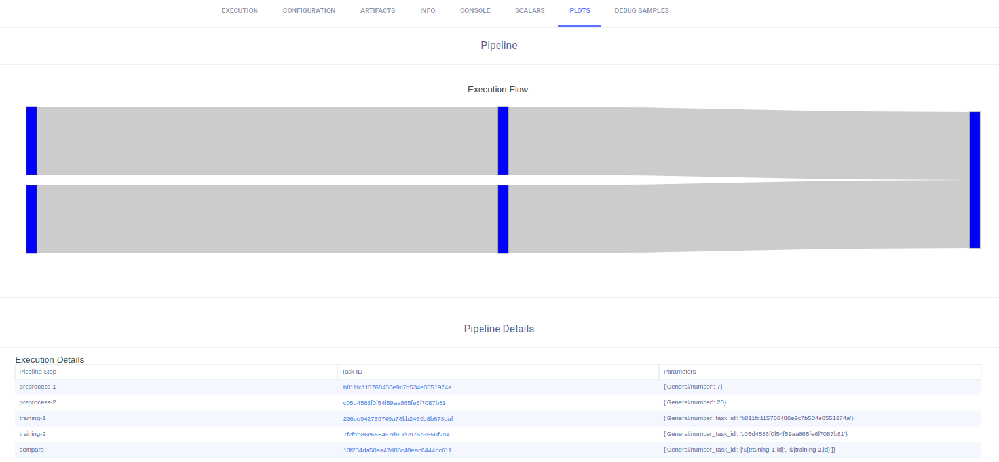

Users can automate [Tasks](task) to run consecutively or according to some logic by putting the Tasks into a pipeline. 
Tasks in a pipeline can leverage other tasks' work products such as artifacts and parameters. 

Pipelines are controlled by a *Controller Task* that holds the logic of the pipeline execution steps. 

## How do pipelines work? 

Before running a pipeline, we need to configure a Controller Task, in which the pipeline is defined. The user decides the controlling logic, whether it be simple 
([DAG](https://en.wikipedia.org/wiki/Directed_acyclic_graph)) or complex custom logic.

Once the pipeline is running, it first clones existing Tasks (called templates) and then sends the cloned Tasks for execution 
according to the pipeline's control logic.



## Simple DAG Pipelines

For a simple, DAG based logic, use the off-the-shelf `PipelineController` class to define the DAG (see an example [here](../guides/pipeline/pipeline_controller)). Once PipelineController object is populated and configured, 
we can start the pipeline, which will launch its first steps, then it waits until the pipeline is completed. 
The pipeline control logic is processed in a background thread. 

## Custom Pipelines

In cases where a DAG is insufficient (for example when needing to launch one pipeline, then, if performance is inadequate, rerun pipeline again), 
users can apply custom logic, using a generic methods to enqueue Tasks, implemented in python code.

The logic of the pipeline sits in a *Controller Task*.
Since a pipeline *Controller Task* is a Task on its own, it's possible to have pipelines running other pipelines.
This gives users greater degrees of freedom for automation. 

Custom pipelines usually involves cloning existing Tasks (Template Tasks), modiftying their parameters and manually enqueuing 
them to queues (For execution by [agents](../clearml_agent.md). Since it's possible to control Task's execution (Including 
overriding Hyperparameters and Artifacts) and get output metrics, it's possible to create custom logic that controls inputs and acts upon outputs.

A simple Custom pipeline may look like this:

```python
task = Task.init('examples', 'Simple Controller Task', task_type=Task.TaskTypes.controller)

# Get a reference to the task to pipe to.
first_task = Task.get_task(project_name='PROJECT NAME', task_name='TASK NAME')

# Clone the task to pipe to. This creates a task with status Draft whose parameters can be modified.
cloned_first_task = Task.clone(source_task=first_task, name='Auto generated cloned task')

cloned_first_task.set_parameters({'key':val})

Task.enqueue(cloned_first_task.id, queue_name='QUEUE NAME')

# Here comes custom logic
#
#
###

# Get a reference to the task to pipe to.
next_task = Task.get_task(project_name='SECOND PROJECT NAME', task_name='SECOND TASK NAME')

# Clone the task to pipe to. This creates a task with status Draft whose parameters can be modified.
cloned_task = Task.clone(source_task=next_task, name='Second Cloned Task')

Task.enqueue(cloned_task.id, queue_name='QUEUE NAME')

```

See an example for custom pipelines [here](https://github.com/allegroai/clearml/tree/master/examples/automation)

:::note
We recommend enqueuing Pipeline Controller Tasks into a 
[services](agents_and_queues#services-agent--queue) queue
:::