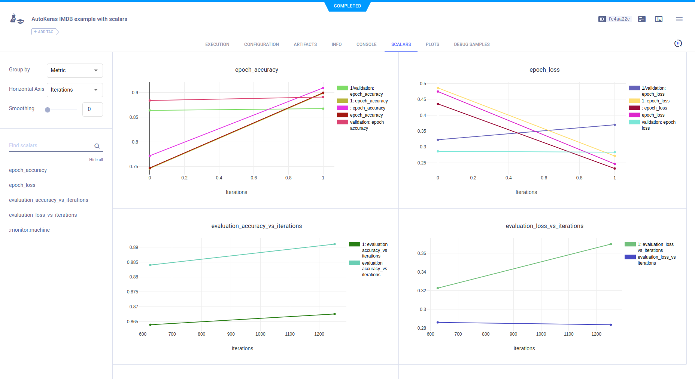
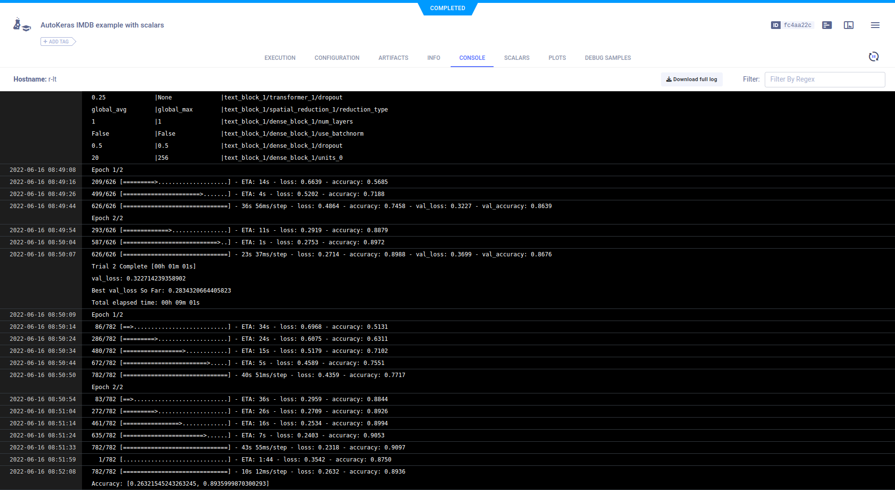
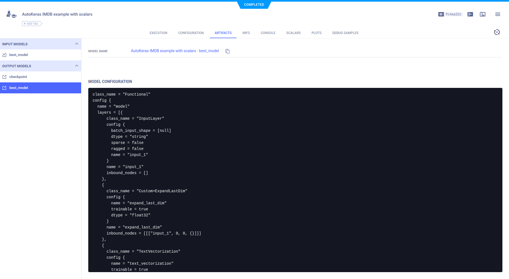
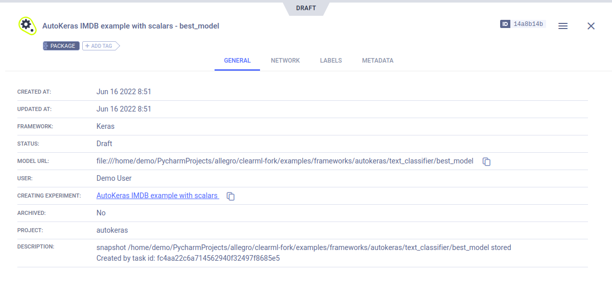

The [autokeras_imdb_example.py](https://github.com/allegroai/clearml/blob/master/examples/frameworks/autokeras/autokeras_imdb_example.py) example 
script demonstrates the integration of **ClearML** into code, which uses [autokeras](https://github.com/keras-team/autokeras). 
It trains text classification networks on the Keras built-in [IMDB](https://keras.io/api/datasets/imdb/) dataset, using the autokeras [TextClassifier](https://autokeras.com/text_classifier/) class, and searches for the best model. It uses two TensorBoard callbacks, one for training and one for testing. **ClearML** automatically logs everything the code sends to TensorBoard. When the script runs, it creates an experiment named `autokeras imdb example with scalars`, which is associated with the `autokeras` project.

## Scalars

The loss and accuracy metric scalar plots appear in **RESULTS** **>** **SCALARS**, along with the resource utilization plots, 
which are titled **:monitor: machine**.

## Hyperparameters

**ClearML** automatically logs TensorFlow Definitions. They appear in **CONFIGURATIONS** **>** **HYPER PARAMETERS** **>** **TF_DEFINE**.

## Log

Text printed to the console for training progress, as well as all other console output, appear in **RESULTS** **>** **LOG**.

## Artifacts

Model artifacts associated with the experiment appear in the info panel of the **EXPERIMENTS** tab and in the model info panel in the **MODELS** tab.  

The experiment info panel shows model tracking, including the model name and design (in this case, no design was stored).

The model info panel contains the model details, including the model URL, framework, and snapshot locations.

