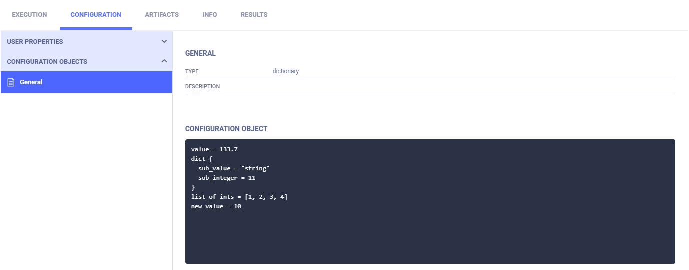
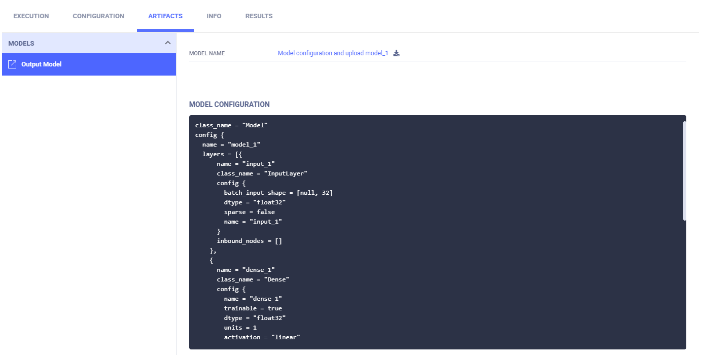

The [manual_model_upload.py](https://github.com/allegroai/clearml/blob/master/examples/frameworks/keras/manual_model_upload.py) 
example demonstrates **ClearML**'s tracking of a manually configured model created with Keras, including: 
* Model checkpoints (snapshots),
* Hyperparameters
* Console output. 
  
When the script runs, it creates an experiment named `Model configuration and upload`, which is associated with the `examples` project.

Configure **ClearML** for model checkpoint (snapshot) storage in any of the following ways ([debug sample](../../../references/sdk/logger.md#set_default_upload_destination) 
storage is different):

* In the configuration file, set [default_output_uri](../../../configs/clearml_conf.md#sdkdevelopment).
* In code, when [initializing a Task](../../../references/sdk/task.md#taskinit), use the `output_uri` parameter.
* In the **ClearML Web UI**, when [modifying an experiment](../../../webapp/webapp_exp_tuning.md#output-destination).

## Configuration

This example shows two ways to connect a configuration, using the [Task.connect_configuration](../../../references/sdk/task.md#connect_configuration)
method. 

* Connect a configuration file by providing the file's path. **ClearML Server** stores a copy of the file.
  
```python
# Connect a local configuration file
config_file = os.path.join('..', '..', 'reporting', 'data_samples', 'sample.json')
config_file = task.connect_configuration(config_file)
```


* Create a configuration dictionary and provide the dictionary.

```python
model_config_dict = {
    'value': 13.37,
    'dict': {'sub_value': 'string', 'sub_integer': 11},
    'list_of_ints': [1, 2, 3, 4],
}
model_config_dict = task.connect_configuration(model_config_dict)
```

If the configuration changes, **ClearML** tracks it.

```python
model_config_dict['new value'] = 10
model_config_dict['value'] *= model_config_dict['new value']
```

The configuration appears in **CONFIGURATIONS** **>** **CONFIGURATION OBJECTS**.



## Artifacts

Model artifacts associated with the experiment appear in the experiment info panel (in the **EXPERIMENTS** tab), and in the model info panel (in the **MODELS** tab).  

The experiment info panel shows model tracking, including the model name and design:



The model info panel contains the model details, including the model URL, framework, and snapshot locations.

