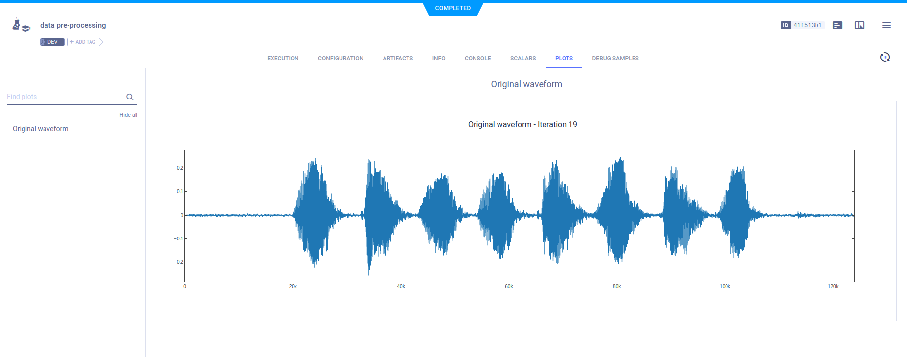
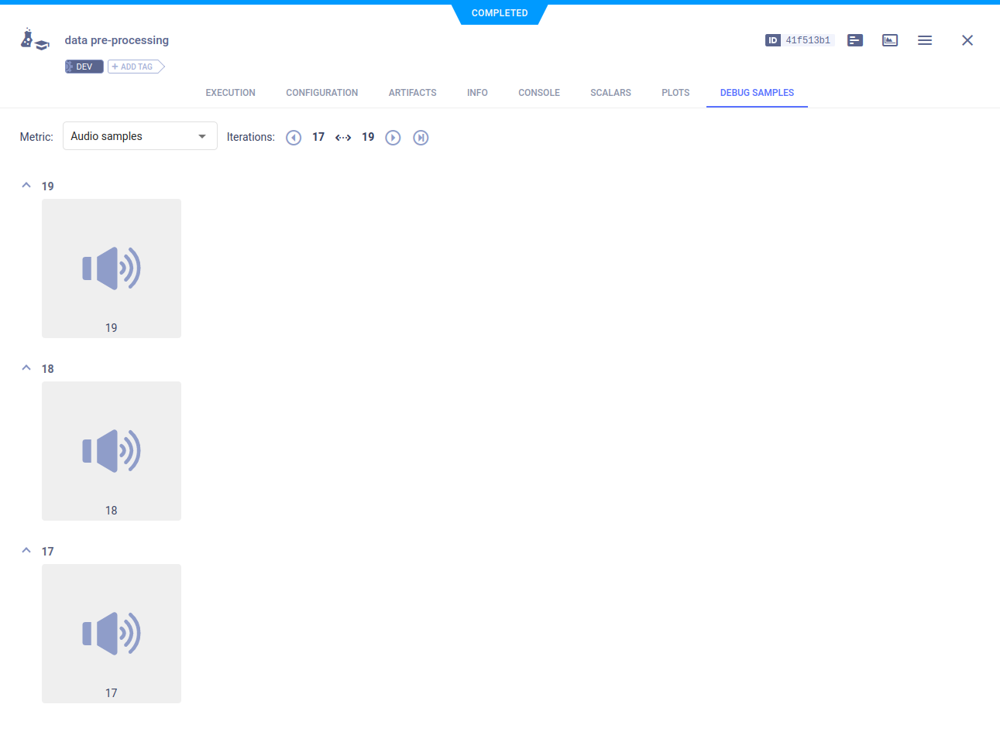
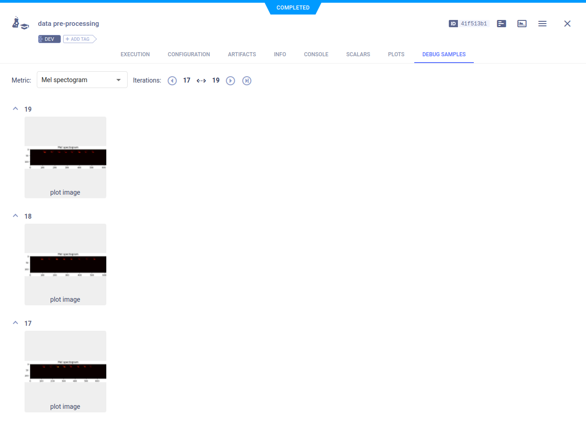

--- 
title: Audio Preprocessing - Jupyter Notebook
---

The example [audio_preprocessing_example.ipynb](https://github.com/allegroai/clearml/blob/master/examples/frameworks/pytorch/notebooks/audio/audio_preprocessing_example.ipynb) 
demonstrates integrating **ClearML** into a Jupyter Notebook which uses PyTorch and preprocesses audio samples. **ClearML** automatically logs spectrogram visualizations reported by calling Matplotlib methods, and audio samples reported by calling TensorBoard methods. In the example, we also demonstrate connecting parameters to a Task and logging them. When the script runs, it creates an experiment named `data pre-processing`, which is associated with the `Audio Example` project.

## Plots

**ClearML** automatically logs the waveform which the example reports by calling a Matplotlib method. These appear in **RESULTS** **>** **PLOTS**.

## Debug samples

**ClearML** automatically logs the audio samples which the example reports by calling TensorBoard methods, and the spectrogram visualizations reported by calling Matplotlib methods. They appear in **RESULTS** **>** **DEBUG SAMPLES**.

### Audio samples

You can play the audio samples by double clicking the audio thumbnail.

### Spectrogram visualizations

You can view the spectrogram visualizations in the **ClearML Web UI** image viewer.

