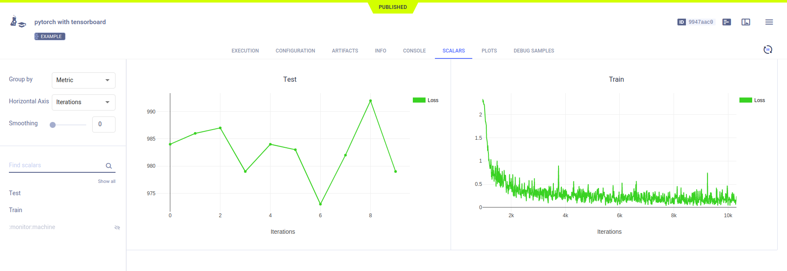
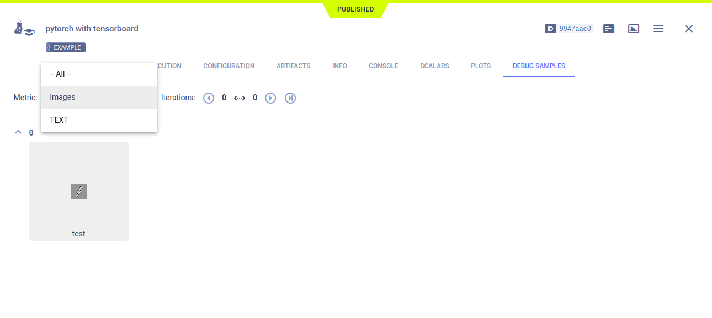
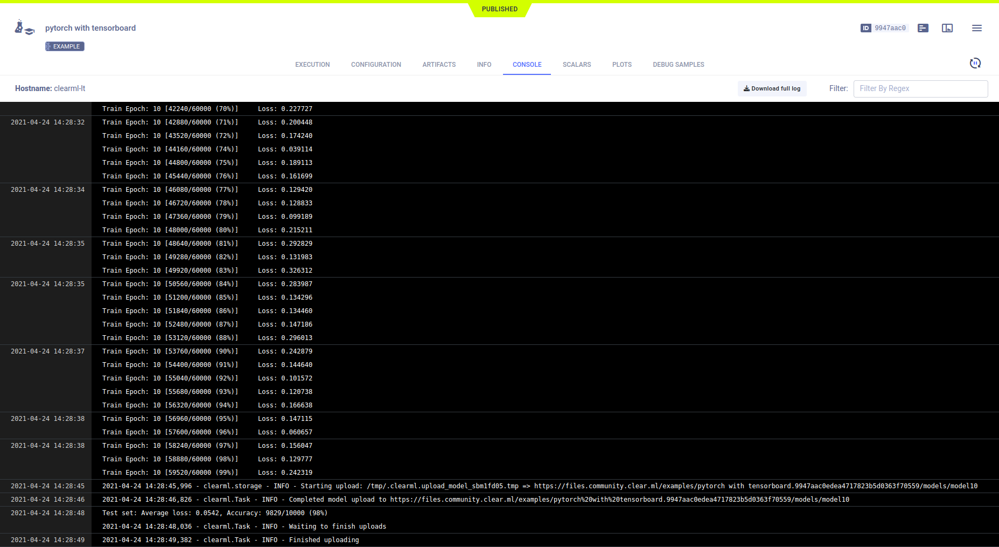
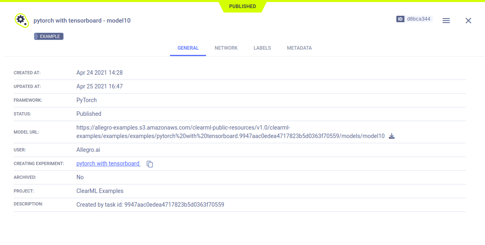

The [pytorch_tensorboard.py](https://github.com/allegroai/clearml/blob/master/examples/frameworks/pytorch/pytorch_tensorboard.py) 
example demonstrates the integration of **ClearML** into code that uses PyTorch and TensorBoard. 

The example does the following:
* Trains a simple deep neural network on the PyTorch built-in [MNIST](https://pytorch.org/vision/stable/datasets.html#mnist) 
  dataset.
* Creates a TensorBoard `SummaryWriter` object to log: 
  * Scalars during training.
  * Scalars and debug samples during testing.
  * Test text message to the console (a test message to demonstrate **ClearML**'s automatic logging).
* Creates an experiment named `pytorch with tensorboard`, which is associated with the `examples` project.

## Scalars

In the example script, the `train` and `test` functions call the TensorBoard `SummaryWriter.add_scalar` method to log loss. 
These scalars, along with the resource utilization plots, which are titled **:monitor: machine**, appear in the experiment's page in the **ClearML web UI** under **RESULTS** **>** **SCALARS**, 

## Debug samples

**ClearML** automatically tracks images and text output to TensorFlow. They appear in **RESULTS** **>** **DEBUG SAMPLES**.

## Hyperparameters

**ClearML** automatically logs TensorFlow Definitions. They appear in **CONFIGURATIONS** **>** **HYPER PARAMETERS** **>** **TF_DEFINE**.

## Console

Text printed to the console for training progress, as well as all other console output, appear in **RESULTS** **>** **CONSOLE**.

## Artifacts

Model artifacts associated with the experiment appear in the info panel of the **EXPERIMENTS** tab and in the info panel 
of the **MODELS** tab.  

The experiment info panel shows model tracking, including the model name and design (in this case, no design was stored).

The model info panel contains the model details, including: 
* Model URL
* Framework
* Snapshot locations.

