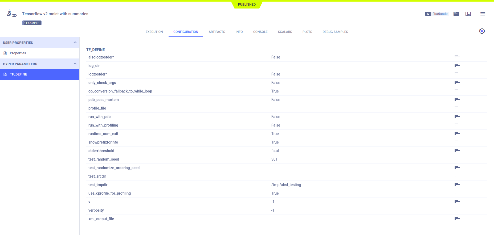
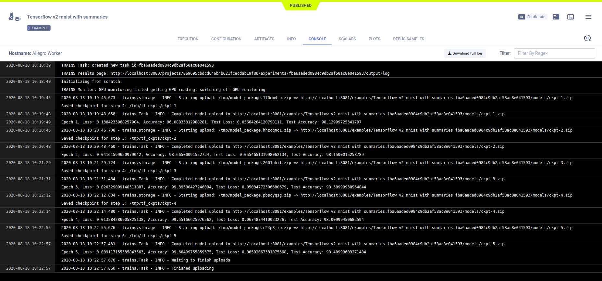
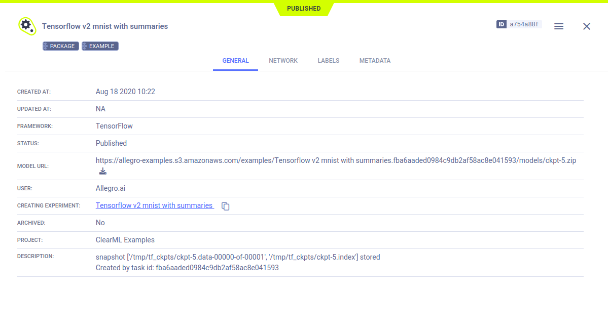

The [tensorflow_mnist.py](https://github.com/allegroai/clearml/blob/master/examples/frameworks/tensorflow/tensorflow_mnist.py) 
example demonstrates the integration of **ClearML** into code that uses TensorFlow and Keras to train a neural network on 
the Keras built-in [MNIST](https://www.tensorflow.org/api_docs/python/tf/keras/datasets/mnist) handwritten digits dataset. 

The script builds a TensorFlow Keras model, and trains and tests it with the following:

* Loss objective function - [tf.keras.metrics.SparseCategoricalCrossentropy](https://www.tensorflow.org/api_docs/python/tf/keras/losses/SparseCategoricalCrossentropy)
* Accuracy metric - [tf.keras.metrics.SparseCategoricalAccuracy](https://www.tensorflow.org/api_docs/python/tf/keras/metrics/SparseCategoricalAccuracy)
* Model checkpointing - [tf.clearml.Checkpoint](https://www.tensorflow.org/api_docs/python/tf/train/Checkpoint?hl=ca) and [tf.train.CheckpointManager](https://www.tensorflow.org/api_docs/python/tf/train/CheckpointManager?hl=ca)

When the script runs, it creates an experiment named `Tensorflow v2 mnist with summaries`, which is associated with the 
`examples` project.

## Scalars

The loss and accuracy metric scalar plots appear in the experiment's page in the **ClearML web UI** under **RESULTS** 
**>** **SCALARS**. Resource utilization plots, which are titled **:monitor: machine**, also appear in the *SCALARS** tab.

## Hyperparameters

**ClearML** automatically logs TensorFlow Definitions. They appear in **CONFIGURATIONS** **>** **HYPER PARAMETERS** 
**>** **TF_DEFINE**.

## Log

All console output appears in **RESULTS** **>** **LOG**.

## Artifacts

Model artifacts associated with the experiment appear in the info panel of the **EXPERIMENTS** tab and in the info panel 
of the **MODELS** tab.  

The experiment info panel shows model tracking, including the model name and design (in this case, no design was stored).

The model info panel contains the model details, including: 
* Model design 
* Label enumeration 
* Model URL 
* Framework
* Snapshot locations.

