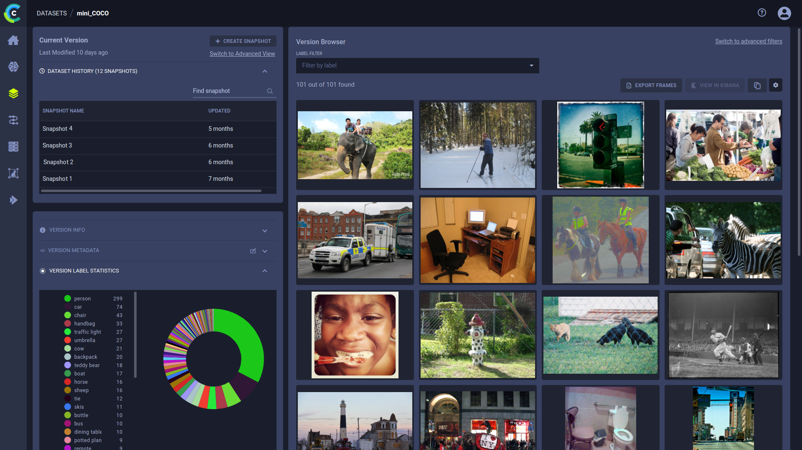

Use the Dataset versioning WebApp (UI) features for viewing, creating, modifying, and
deleting Dataset versions.

From the Datasets page, click on one of the Datasets in order to see and work with its versions.

### Viewing snapshots

View snapshots in the simple version structure using either:

* The simple view, a table of snapshots.

Simple view (snapshot table)

 

* The advanced view, a tree of versions. The tree contains one version whose status is <i>Draft</i>, and snapshots appear in
chronological order, with oldest at the top, and the most recent at the bottom.

Advanced view (version tree)

### Creating snapshots

To create a snapshot, you must be in the simple (version table) view.

**To create a snapshot, do the following:**

1. If you are in the advanced view, click **Switch to Simple View** (In certain situations, this may not be possible,
   see [Dataset Versioning](../dataset.md#dataset-versioning))
1. If the **DATASET HISTORY** section is not opened, click it.
1. If a snapshot is currently selected, click **RETURN TO CURRENT VERSION**.
1. Click **+ CREATE SNAPSHOT**.
1. Enter a version name, and optionally a description.
1. Click **CREATE**.

:::note
The WebApp (UI) does not currently support the automatic naming of snapshots with timestamps appended. You must provide a snapshot name.
:::

### Creating versions

To create a version, you must be in the advanced (version tree) view.

**To create a child version, do the following:**

1. If you are in the simple view, click **Switch to Advanced View**.
1. Click the (parent) version from which to create a child (inherit all frames).
1. Click **+ CREATE NEW VERSION**.
1. Enter a version name, and optionally a description.
1. Click **CREATE**.

### Publishing versions

Publish (make read-only) any Dataset version whose status is *Draft*. If the Dataset is in the simple structure,
and you publish the current version, then only the advanced view is available,
and you cannot create snapshots.

**To publish a version, do the following:**

1. If you are in the simple view, click **Switch to Advanced View**.
1. Click the version to publish.
1. Click **PUBLISH**.
1. Click **PUBLISH** again to confirm.

### Exporting frames

Frame exports downloaded filtered frames as a JSON file.

**To export frames, do the following:**

* In the Thumbnails area, click **EXPORT FRAMES**. The frames JSON file downloads.

### Modifying version names

**To modify a Dataset version name, do the following:**

* At the top right of the Dataset page, hover over the Dataset version name, click  , edit the name, and then click  (check).

### Modifying version descriptions

**To modify a version description, do the following:**

* Expand the **INFO** area, hover over the **Description**, click ,
  edit the name, and then click  (check).

### Deleting versions

You can delete versions whose status is *Draft*.

**To delete the current version, do the following:**

* If you are in the simple view, click **Switch to Advanced View**.
* Click the version to delete.
* Click **DELETE**.
* Click **DELETE** again to confirm.
